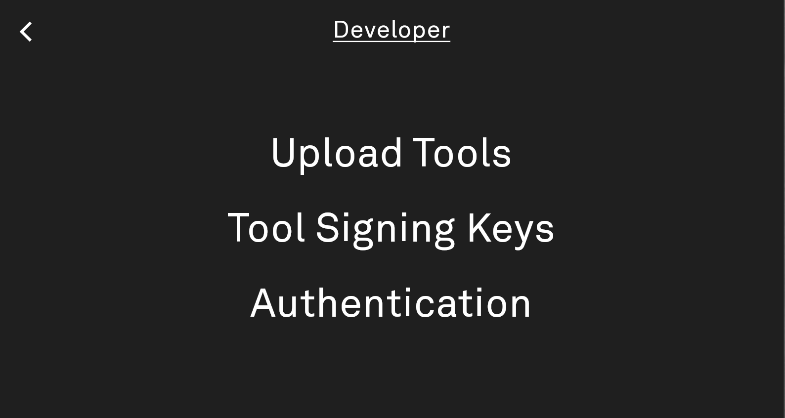

# Installing Tools Locally

The Light SDK Server allows for LP3 owners (or emulator users) to install tools locally using the [Tool Manager](https://github.com/lightphone/light-tool-manager). 
The main reasons to do this are:
- You are a developer and you want to test out builds of your tool from your own development environment.
- You want to try out a tool from a trusted third-party developer that is not signed by Light.

**Note that as of August 25, 2026, this functionality has not yet been rolled out to LightOS production builds. Coming soon!**

## Process

Suppose you have an APK that you want to install on your computer.

1. First, ensure that your LP3 is on the same (trusted) WiFi network as your computer. We also recommend plugging it into a charger while using the Tool Manager.
    - If you're using the emulator, it should be running on the _same_ computer.
2. Ensure that developer mode is enabled for your LP3 on the [user dashboard](https://dashboard.thelightphone.com)
3. Start up the Tool Manager from LP3/emulator Settings (**launch point subject to change**). It should show a copy-able URL or QR code when running.
4. Copy the URL (QR scanning site coming soon) to your computer's browser. The alphanumeric string at the end of the URL is for authentication - make sure you copy that too!
5. From the Tool Manager root, select `Developer` (which will only show on an LP3 if developer mode is enabled!)
6. You should see 3 places to manage files:



7. In the `Developer Keys` file browser, upload the _SHA-256 fingerprint_ of the key that was used to sign the APK you are trying to upload. It should be uploaded as a plain text file, and the only content should be the 64-character alphanumeric key hash. See the [example](light_debug_signing_key.txt) in this directory, which holds the hash for the [development key](../../sdk/keys) we bundle here with the SDK. **Note that the SDK server will treat any APKs signed with _any_ of the keys that you have uploaded here as effectively "Light Approved". Use at your own risk. Only use keys from developers you trust.**
8. On the `Upload Tools` screen, you'll see a button that let you choose an APK to be uploaded using a native file picker. Once the upload is complete, the Light SDK server will kick off a background job that attempts to install the APK. The job should succeed if:
   - The APK being installed has _not_ already been installed on your device with a different signature.
   - The APK being installed has a version number greater than or equal to a previously installed build.
   - The APK passes the SDK server's security check, meaning that _either_:
     - The APK was signed + approved by Light
     - The APK was signed using one of the keys manually uploaded in step 7, above
     - The device's filter level is set to allow any arbitrary APK to be installed.
9. After the APK upload is complete, you can exit the Tool Manager and the newly installed tool should appear in your Toolbox soon.

### Installing from your dev environment

We have provided a [Gradle task](../../tool/build.gradle.kts#L89) that lets you skip the process of opening your browser and manually uploading your tool's APK.

To set this up, follow steps 1-6 in the `Process` section above. Then,
1. In the `Authentication` file browser, upload a file containing a private key that your dev machine will use to authenticate with the Tool Manager. Every request is HMAC-signed with this key, so **it must be a 64-character hex string**, not an arbitrary password - for example, the output of:

   ```
   openssl rand -hex 32
   ```

   Upload it as a plain text file containing only that hex string. **When the Tool Manager runs, this key can be used to access _any_ of the API endpoints. Keep it safe!** These files are encrypted before being saved to disk on the device.
2. Run the `uploadTool` Gradle task from the `tool` module, pointing it at your LP3/emulator's IP address and the key you just uploaded:

   ```
   ./gradlew :tool:uploadTool -Pdevice.ip=192.168.1.42 -Pdevice.token=<your hex key>
   ```

   - `device.ip` is the plain IP address of your LP3/emulator on the local network. Defaults to `127.0.0.1`.
   - `device.token` is the hex key you uploaded in step 1, above.
   - `device.port` defaults to `54449`. Override it if your Tool Manager is listening elsewhere.
   - `device.timeoutSeconds` defaults to `60`; increase it if the device is slow to install.

   If you're using the emulator, its network is isolated from your host machine, so `127.0.0.1` won't reach it directly. Forward whichever port the Tool Manager is using from the emulator to your host first:

   ```
   adb forward tcp:54449 tcp:54449
   ```

   Then use `127.0.0.1` (the default) as `device.ip` — traffic to that port on your host will be tunneled to the emulator.

   The task assembles the debug APK, uploads it to the device's APK inbox, and then polls the device until it reports that the tool has been installed/updated, so you'll know the moment it's ready to launch.

## Uninstalling Tools

// TODO coming in follow-up PR
