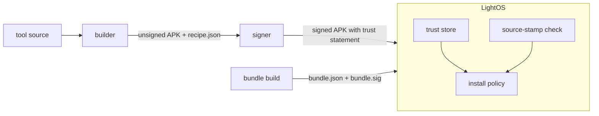

# Tool signing and trust statements

Tools are built and signed using Light CI infrastructure, and then verified in the phone by LightOS.
Signing lets LightOS confirm that an APK came through Light's build pipeline and was not modified afterward.
Android also uses the APK signing key as the app's identity, allowing updates only when they are signed by the same per-tool key.

Separately, Light publishes a signed trust bundle that tells devices which tools are approved or blocked.

- [Trust bundle and trust store](trust_bundle.md): what the bundle holds and how the device keeps it.
- [Install policy](install_policy.md): how the device decides whether an APK can be installed.
- [Threat matrix](threat_matrix.md): the attacks the policy is tested against.

## Building tools

The builder runs the build scripts from the tool repo in an isolated environment with no signing keys, producing:
- `tool-unsigned.apk`: the unsigned Android package.
- `recipe.json`: a record of the artifact, tool source, SDK git ref, and build inputs.

The `tool` object and `sdkGitRef` in the recipe are later copied into the trust statement.
Builder code lives in `builder/`.

## Signing APKs

Signing happens separately from building, in `signer/`. The signer will:
1. verify the unsigned APK against its build recipe
2. check in `registry.json` that the developer owns the tool ID, and look up its APK signing key
3. add the trust statement file to the APK at `META-INF/light-trust.json`
4. sign the APK with its per-tool Android signing key and Light source-stamp key.

The trust statement identifies the tool, SDK, developer, build, and APK signing certificate.
Android's APK source stamp authenticates the complete signed APK, including the statement.
See [`signer/README.md`](../../signer/README.md) for commands.

## Verifying signed APKs

The device verifies the APK source stamp against its trusted stamp certificates before it
reads the statement. It then checks the statement against the APK:
- `signerSha256` must match the APK certificate reported by Android
- `tool.versionCode` must match the manifest

The statement carries no independent signature. 
It must never be trusted unless the containing APK's source stamp has already verified.
It also never grants approval, that only comes from the trust bundle.

## Code

The pure-JVM verification code lives in `sdk/trust/`, with no Android dependencies:

- `LightTrustStatement` and `LightTrustBundle` define the statement and bundle fields, parsed by `TrustParsers`.
- `StampVerifier` isolates platform source-stamp verification from pure policy.
- `LightTrustBundleVerifier` checks the bundle signature against pinned public keys.
- `LightTrustStore` keeps the newest accepted bundle and the trusted stamp certificates.
- `LightInstallPolicy` decides whether an APK can be installed.

Platform stamp verification belongs to LightOS. The `apksig`-based `ApkSigStampVerifier` is test-only.
The byte-level bundle format is described in [`trust-format/README.md`](../../trust-format/README.md).
