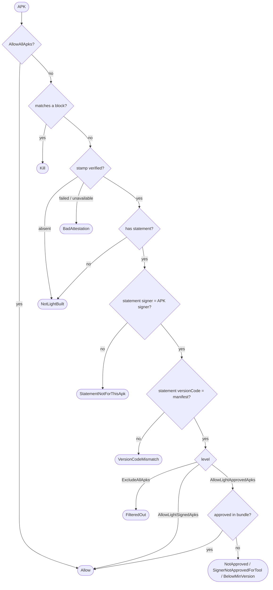

# Install policy

`LightInstallPolicy.decide` answers "can this APK be installed?". It is a pure function of:
- the source-stamp result
- the trust statement, if any
- the APK signing certificate reported by Android
- the manifest `versionCode`
- the current trust bundle, if any
- the device filter level.

The stamp result must already be checked against the trust store's trusted stamp certificates.

## Filter levels

| Level                    | Installs                                           |
|--------------------------|----------------------------------------------------|
| `ExcludeAllApks`         | no third-party APKs                                |
| `AllowLightApprovedApks` | Light-signed APKs approved in the trust bundle     |
| `AllowLightSignedApks`   | any Light-signed APK                               |
| `AllowAllApks`           | anything, without checking                         |

To tell a user what a stricter level would have done with an APK, call `decide` again with that level.

## Decision flow

An APK is approved when the bundle has an `allow` entry for its tool ID, with the same signing certificate,
a `minVersionCode` at or below its `versionCode`, and an approved artifact matching its `buildId` or APK hash.

## Outcomes

`Allow` installs the APK. `Deny` refuses it with one of these reasons:

| Reason                     | Meaning                                                        |
|----------------------------|----------------------------------------------------------------|
| `NotLightBuilt`            | no Light stamp, or no trust statement                          |
| `BadAttestation`           | the stamp does not verify, or could not be verified            |
| `StatementNotForThisApk`   | the statement names a different signing certificate            |
| `VersionCodeMismatch`      | the statement and manifest disagree about `versionCode`        |
| `FilteredOut`              | the level admits no third-party APKs                           |
| `NotApproved`              | no approval for this tool, or none covering this artifact      |
| `BelowMinVersion`          | superseded by the approval's version floor                     |
| `SignerNotApprovedForTool` | the tool is approved under a different signing certificate     |

`Kill` applies a matching bundle block, with its `block` or `purge` action and the bundle's reason.

## Why blocks come first

Blocks are checked before the stamp, so a blocked tool is killed however well-formed it is.
That means block matching reads the tool ID and `versionCode` from a statement nothing has authenticated yet.
This is only safe in one direction: a forged statement can match a block and kill its own APK,
but approval is read after the stamp check, so it can never buy an install.

## APK hash

Hashing the APK is the most expensive step, so it is computed lazily and at most once.
Blocks and approvals match on everything else first, and hash the APK only when an `apkSha256` rule is left to check.
